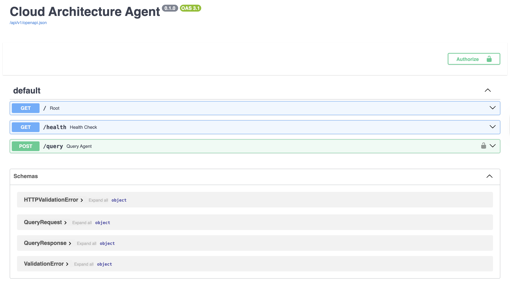

# AWS Cloud Architecture Agent

A production-grade GenAI agent backend for AWS cloud architecture reasoning, built with Python, FastAPI, and vLLM.

[](https://www.python.org/downloads/)
[](https://fastapi.tiangolo.com/)
[](https://opensource.org/licenses/MIT)

> **Note on AWS Documentation**: This project uses AWS documentation from [docs.aws.amazon.com](https://docs.aws.amazon.com/) (licensed under [CC-BY-SA-4.0](https://creativecommons.org/licenses/by-sa/4.0/)). The docs aren't included in this repo—you'll need to fetch them using the provided script.

---

## What's This About?

This is a backend API that uses RAG (Retrieval-Augmented Generation) to answer questions about AWS cloud architecture. Instead of relying on external APIs like OpenAI, it runs a self-hosted LLM (Llama 3.1) on AWS EC2 and searches through AWS documentation to provide accurate, sourced answers.

**Tech stack:** Python, FastAPI, vLLM, Qdrant, Docker, AWS EC2

---

## 🏗️ Architecture

```
┌─────────────┐
│   Client    │
└──────┬──────┘
       │ HTTP Request
       ↓
┌──────────────────────────────────────┐
│  FastAPI Application (Port 8001)     │
│  ├─ API Key Authentication           │
│  ├─ Rate Limiting (5 req/min)        │
│  └─ HTTP Error Handling (401/429/503)│
└──────┬──────────────────┬────────────┘
       │                  │
       │ Search           │ Generate
       ↓                  ↓
┌──────────────┐   ┌─────────────────┐
│   Qdrant     │   │  vLLM (EC2 GPU) │
│  Vector DB   │   │  Llama-3.1-8B   │
│  (RAG)       │   │  Port 8000      │
└──────────────┘   └─────────────────┘
```

When you ask a question:
1. The API validates your API key and checks rate limits
2. Your question gets embedded and used to search AWS docs in Qdrant
3. Relevant docs are sent to the LLM (running on EC2) as context
4. The LLM generates an answer based on that context
5. You get a JSON response with the answer and source documents

For the full architectural breakdown, see [docs/architecture.md](docs/architecture.md).

---

## 🚀 Demo

### 📸 Screenshots

**Swagger UI with Authentication:**



*Interactive API documentation with 🔒 authentication locks on protected endpoints*

**Example Query:**
```bash
curl -X POST http://localhost:8001/query \
  -H "Content-Type: application/json" \
  -H "X-API-Key: your-key" \
  -d '{"question": "How do I set up VPC peering?"}'
```

**Response:**
```json
{
  "question": "How do I set up VPC peering?",
  "answer": "VPC peering allows you to connect two VPCs privately...",
  "sources": ["vpc-peering.md"]
}
```

> **Note:** The GPU instance is stopped most of the time to save costs (~$12/day). I can spin it up for a live demo with 30 minutes notice.

---

## Key Features

- **API Security**: API key authentication and rate limiting (5 req/min per IP)
- **Error Handling**: Proper HTTP status codes (401, 429, 503, 500) with clear messages
- **RAG Implementation**: Vector search with Qdrant for document retrieval
- **Self-hosted LLM**: vLLM running Llama 3.1 on AWS EC2 GPU
- **Clean Code**: Type hints, error propagation, structured logging

---

## Why These Choices?

**vLLM over OpenAI API:**
- Full control over the model and data
- No per-token costs (just EC2 compute at ~$0.53/hour)
- Lower latency—no external API calls
- Good practice for real-world ML deployment

**RAG over Fine-tuning:**
- Can update documentation without retraining
- Shows exactly which docs were used (transparency)
- Much cheaper—no training compute needed
- Easier to maintain

**FastAPI + Qdrant + Docker:**
- FastAPI gives you async support and auto-generated docs
- Qdrant is fast and easy to run locally
- Docker keeps everything reproducible

---

## 📦 Quick Start

### Prerequisites
- Python 3.10+
- Docker (for Qdrant)
- AWS account (for EC2 GPU deployment)

### 1. Local Development Setup

```bash
# Clone and install
git clone https://github.com/illoonego/cloud-architecture-agent.git
cd cloud-architecture-agent
python -m venv .venv
source .venv/bin/activate
pip install -e .
```

### 2. Get the AWS documentation

```bash
python scripts/fetch_docs.py
```

### 3. Start Qdrant and build the index

```bash
docker run -d --name qdrant -p 6333:6333 \
  -v $(pwd)/qdrant_storage:/qdrant/storage \
  qdrant/qdrant:latest

python scripts/build_index.py
```

### 4. Configure your environment

```bash
# Create .env file (see .env.example)
# Set VLLM_API_URL, AWS_SECRET_NAME, and AWS_REGION
```

### 5. Run the API

```bash
python -m uvicorn src.api.main:app --reload --port 8001
```

Test it:
```bash
# Health check (no auth required)
curl http://localhost:8001/health

# Query with API key
curl -X POST http://localhost:8001/query \
  -H "Content-Type: application/json" \
  -H "X-API-Key: your-generated-key" \
  -d '{"question": "What is a VPC?"}'

# Interactive docs
open http://localhost:8001/docs
```

---

## 🌩️ AWS Deployment

### EC2 GPU Setup (vLLM)

```bash
# 1. Launch g4dn.xlarge instance (Ubuntu 24.04 Deep Learning AMI)
# 2. Allocate Elastic IP and associate with instance
# 3. SSH into instance
ssh -i your-key.pem ubuntu@YOUR-ELASTIC-IP

# 4. Deploy vLLM
docker run -d --name vllm-server \
  --gpus all \
  -p 8000:8000 \
  -e HUGGING_FACE_HUB_TOKEN='your-token' \
  vllm/vllm-openai:v0.6.2 \
  --model meta-llama/Llama-3.1-8B-Instruct \
  --dtype half \
  --max-model-len 4096
```

**Cost note:** The g4dn.xlarge costs ~$0.53/hour ($12.72/day). I stop the instance when not using it (storage is only ~$5-10/month).

For detailed EC2 setup with GPU, security groups, and Elastic IP configuration, see [docs/ec2-setup-walkthrough.md](docs/ec2-setup-walkthrough.md).

---

## Project Structure

```
cloud-architecture-agent/
├── src/
│   ├── api/           # FastAPI application + auth
│   ├── agent/         # Agent orchestration logic
│   ├── llm/           # vLLM client
│   ├── rag/           # Vector search (embeddings, indexing, retrieval)
│   └── config/        # Settings management
├── tests/             # Unit and integration tests
├── scripts/           # Utility scripts (fetch docs, build index)
├── docs/              # Additional documentation
│   ├── architecture.md       # Detailed system design
│   ├── ec2-setup-walkthrough.md  # Step-by-step EC2 guide
│   └── deployment.md         # Production deployment guide
├── infra/docker/      # Dockerfiles
├── .env.example       # Environment template
└── pyproject.toml     # Dependencies
```

---

## Testing

```bash
# Run tests
pytest tests/

# Test with coverage
pytest --cov=src tests/

# Specific test file
pytest tests/test_agent.py -v
```

**Test Coverage:**
- Unit tests for RAG retrieval
- Integration tests for agent pipeline
- API endpoint tests with auth

---

## Documentation

- [docs/architecture.md](docs/architecture.md) - System design and architecture decisions
- [docs/api.md](docs/api.md) - Complete API reference with all endpoints and error codes
- [docs/deployment.md](docs/deployment.md) - Production deployment guide
- [docs/ec2-setup-walkthrough.md](docs/ec2-setup-walkthrough.md) - Step-by-step EC2 GPU setup

---

## License

MIT License - See [LICENSE](LICENSE)
