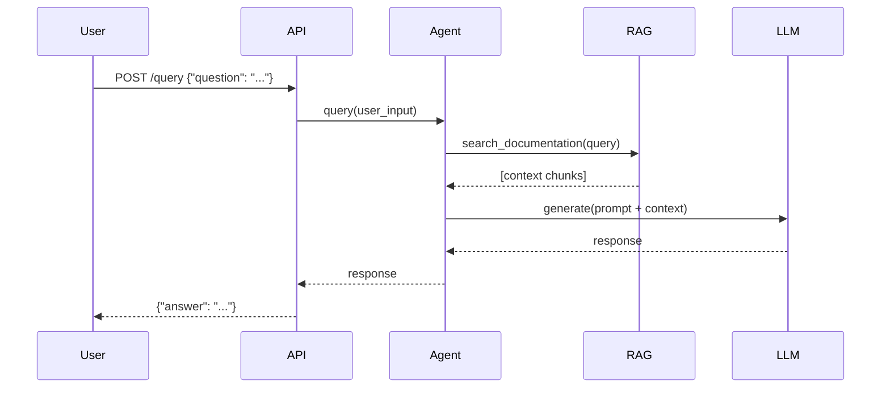

# Architecture

## Top-Level Architecture

```text
                    TOP-LEVEL ARCHITECTURE

               ┌────────────────────────────┐
               │        Client / User       │
               │  (CLI, curl, UI, Postman)  │
               └──────────────┬─────────────┘
                              │  HTTPS
                              ▼
                ┌───────────────────────────┐
                │  Agent API (FastAPI)      │
                │  - /query, /health        │
                │  - runs on AWS (ECS/EC2)  │
                └──────────────┬────────────┘
                       uses    │
        ┌──────────────────────┼─────────────────────────┐
        │                      │                         │
        ▼                      ▼                         ▼
┌───────────────┐      ┌────────────────┐        ┌─────────────────────┐
│  RAG Layer    │      │ Tools / Logic  │        │    LLM Service      │
│  - retriever  │      │ - Terraform    │        │  (vLLM on AWS EC2)  │
│  - embeddings │      │ - error expl.  │        │  - Llama-3.1-8B     │
└──────┬────────┘      │ - arch helper  │        │  - OpenAI-style API │
       │               └────────────────┘        └─────────┬───────────┘
       │                                         HTTP      │
       ▼                                                   │
┌──────────────┐                                           │
│  Vector DB   │  (Chroma/Qdrant or similar)               │
└──────────────┘                                           │
                                                           │
                            ┌──────────────────────────────┘
                            ▼
            ┌───────────────────────────────────────────┐
            │    AWS & MLOps Infrastructure             │
            │    - ECS/EC2 for Agent API container      │
            │    - EC2 GPU instance for vLLM            │
            │    - S3 for docs (optional)               │
            │    - CloudWatch logs & metrics            │
            │    - GitHub Actions CI/CD (build & deploy)│
            └───────────────────────────────────────────┘
```

## Component Breakdown

### 1. Agent API (The Brain)
- **Technology**: Python, FastAPI.
- **Role**: The central orchestrator. It receives user queries, coordinates with the RAG layer and Tools, and sends the final prompt to the LLM.
- **Deployment**: Docker container running on AWS ECS (Elastic Container Service) or EC2.

### 2. LLM Service (The Intelligence)
- **Technology**: vLLM (High-throughput LLM serving).
- **Model**: Llama-3.1-8B-Instruct or similar open-source models.
- **Role**: Generates the actual text responses. It is "stateless" and doesn't know about your private data unless you provide it in the prompt.
- **Deployment**: AWS EC2 instance with GPU support (e.g., g4dn.xlarge with T4 GPU).

### 3. RAG Layer (The Memory)
- **Technology**: Qdrant, ChromaDB, or FAISS.
- **Role**: Stores "embeddings" (mathematical representations) of your documents (AWS whitepapers, architecture guides). It retrieves the most relevant info to help the LLM answer accurately.

### 4. Tools / Logic
- **Role**: Specific Python functions the agent can call.
- **Examples**:
    - `terraform_plan_analyzer`: Reads a Terraform file and explains it.
    - `cost_estimator`: Calculates estimated AWS costs.

## Implementation Details

### Project Structure
```
src/
├── api/          # FastAPI application
│   └── main.py   # API endpoints (/query, /health)
├── agent/        # Agent orchestration
│   ├── router.py # Main agent logic (RAG → LLM → Response)
│   └── tools.py  # Agent tools (search_documentation)
├── llm/          # LLM client
│   └── client.py # vLLM OpenAI-compatible client
├── rag/          # RAG components
│   ├── embeddings.py  # Text-to-vector conversion
│   ├── indexing.py    # Document ingestion
│   └── retriever.py   # Vector search
└── config/       # Configuration
    └── settings.py    # Centralized settings
```

### Data Flow



### Key Design Patterns

1. **Singleton Pattern**: `get_embedding_service()` and `get_retriever()` use `@lru_cache` to ensure single instances.

2. **Dependency Injection**: Components accept optional dependencies for testability:
   ```python
   def __init__(self, client: QdrantClient | None = None):
       self.client = client or QdrantClient(...)
   ```

3. **Configuration Management**: All settings centralized in `settings.py` with `.env` support.

4. **Error Handling**: Graceful degradation when services are unavailable.

### Technology Stack

- **API Framework**: FastAPI (async, OpenAPI docs)
- **LLM Server**: vLLM (high-throughput inference)
- **Vector DB**: Qdrant (in-memory or server mode)
- **Embeddings**: SentenceTransformers (all-MiniLM-L6-v2)
- **Containerization**: Docker
- **Deployment**: AWS ECS/EC2
- **CI/CD**: GitHub Actions (planned)
